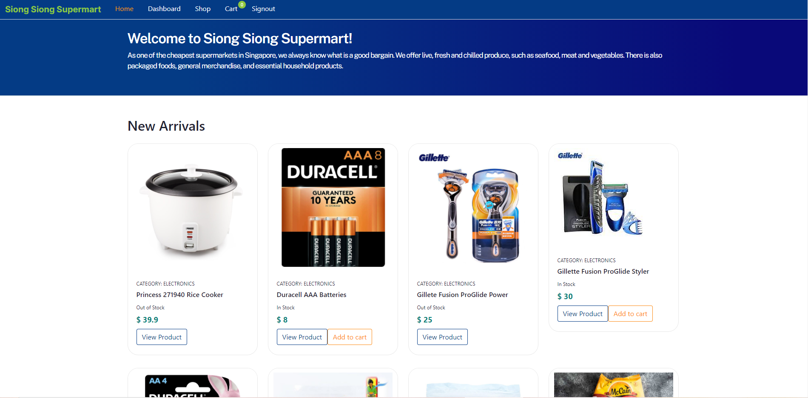
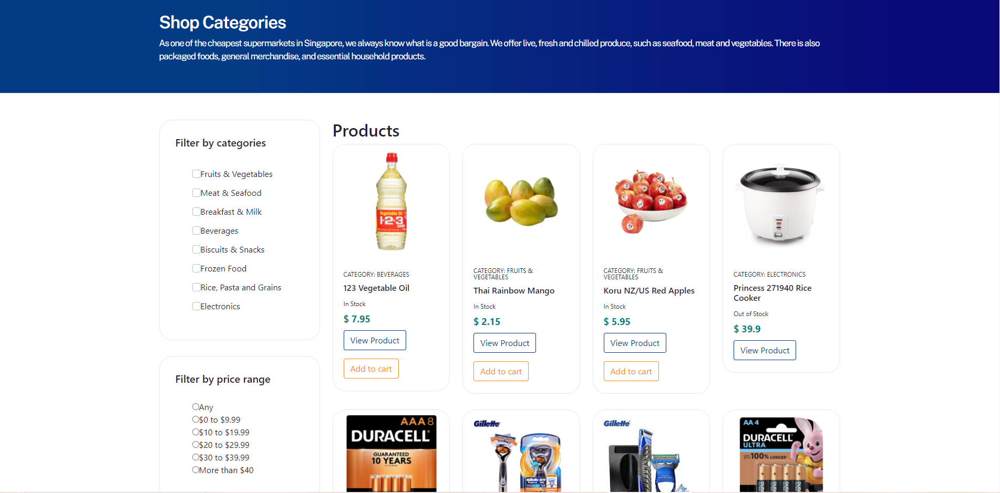
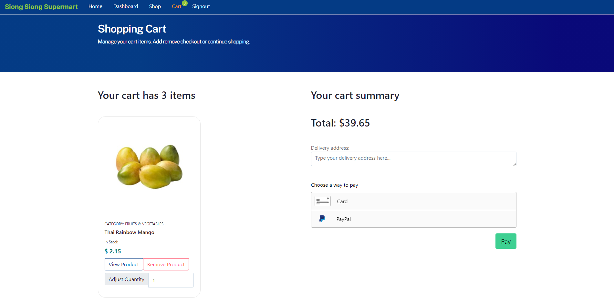
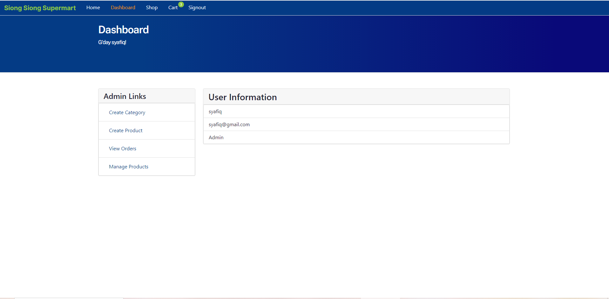
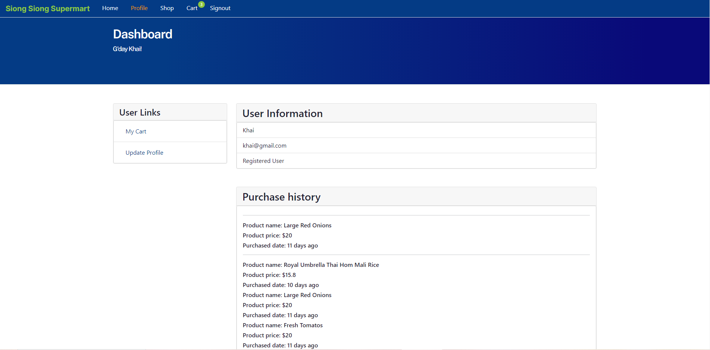

<h1 align="center">Siong Siong Supermarket App</h1>

An online application for users/customers to filter through products offered by the supermarket via categories or price range, and add desired products to cart before paying for their purchase via paypal or credit card. While admin is able to add, edit products and even update order status of customers purchases.

## Links

- [Repo - Frontend](<https://github.com/syafiqsaleem/supermarket-fe>)

- [Repo - Backend](<https://github.com/syafiqsaleem/supermarket---BE>)

- [App - Heroku](<https://siongsiongsupermarketapp-fe.herokuapp.com/> "App")

## Screenshots
### Home Page

### Shop Categories

### Shopping Cart

### Admin

### User

## Instructions
1. Register and create an account to use the app.
2. Login upon completion on registering.
3. Browse through the products and add to cart.
4. Complete payment

## Available Routes 

In the project directory, you can access:

### `Admin`

- Create New Category for Products
- Create New Products
- View & Edit Orders Status
- Manage Products

### `User`

- Items in purchase cart 
- Update user profile
- Add to cart products
- Make payments

## MVP
Features:

1. View and edit orders status
2. Manage Products
3. Stock/Inventory management
4. Credit card & Paypal payment method 
5. Add to cart button disabled when product is out of stock

## Built With

- Mongo
- Express
- React
- Node
- Express
- Mongoose
- Formidable (image upload handling)
- Moment (date handling)
- Braintree (payment)
- Node Sass
- React Bootstrap
- JSON web token

## Future Updates

- [ ] Delivery Schedule
- [ ] More payment options (e.g. google pay)
- [ ] Related products under single product view
- [ ] Cash on delivery option
- [ ] More filtering options
- [ ] Product search
- [ ] Improve user experience for cart (dynamic change when adding to cart)
- [ ] Improve UI for checkout and payment

## Author

**Anthony Ong**
- [Profile](https://github.com/doomvell13)

**Mohamed Syafiq**
- [Profile](https://github.com/syafiqsaleem)

## 🤝 Support

Contributions, issues, and feature requests are welcome!

Give a ⭐️ if you like this project!
